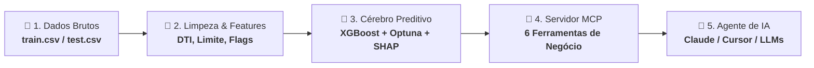

# 🏦 Agente de Risco IA (Agent Risk AI) — ML + MCP Server


> **Agente de Risco IA**: Seu analista autônomo de inteligência e risco de crédito via MCP.
> Um modelo de **previsão de inadimplência de cartão de crédito**, treinado com rigor
> metodológico (CV estratificada, tuning bayesiano com Optuna, threshold otimizado, explicabilidade
> via SHAP) e exposto como **servidor MCP** — consultável diretamente por
> Claude Desktop/Code e agentes de IA em linguagem natural.

---

## 📌 Por que este projeto é diferente de "só treinar um modelo"

A maioria dos projetos de portfólio para de treinar o modelo e mostrar um `.ipynb`
com métricas. Este vai um passo além: o modelo é encapsulado em um **servidor MCP**
(Model Context Protocol) com 6 ferramentas de negócio, o que significa que qualquer
LLM host compatível (Claude Desktop, Claude Code) pode consultar o modelo **em
linguagem natural**, sem escrever código:

> 🗣️ *"Qual o risco de default deste cliente: idade 46, renda R$107.934, score
> de crédito 544, 2 inadimplências anteriores?"*
> 🤖 → chama `predict_default` → responde com probabilidade, classe e explicação SHAP.

Isso é exatamente o padrão que está emergindo em times de risco/dados que querem
colocar modelos de produção "na conversa", não atrás de um dashboard estático.

---

## 🗂️ O problema de negócio

Dataset de **45.528 clientes** de cartão de crédito com variáveis demográficas,
de renda e de comportamento de crédito. Alvo: `credit_card_default` (binário),
com **desbalanceamento real de 8,1%** de inadimplência — cenário típico de risco
de crédito, onde acurácia ingênua é uma métrica enganosa.

| | |
|---|---|
| Linhas de treino | 45.528 |
| Taxa de inadimplência | 8,12% (desbalanceado) |
| Variáveis originais | 17 (+ `customer_id`, `name`) |
| Variáveis após engenharia | 30 |

---

## 🏗️ Como o Sistema Funciona (Arquitetura Simples)

O projeto transforma dados brutos de crédito em decisões acionáveis e auditáveis consumidas por agentes de IA através de **4 etapas integradas**:



### O Fluxo em 4 Passos:

1. **📁 1. Tratamento & Inteligência Financeira (`data_processing.py` / `feature_engineering.py`)**
   * Remove dados sensíveis (PII) e trata anomalias do dataset (como o sentinela de aposentados).
   * Cria indicadores financeiros reais: *Debt-to-Income (DTI)*, *utilização de limite* e *renda per capita*.

2. **🤖 2. Pipeline de Machine Learning (`pipeline.py` / `train.py`)**
   * Executa transformações (imputação, one-hot encoding e escala) de forma estanque (sem vazamento de dados).
   * Treina e ajusta o **XGBoost via Optuna (25 trials)** em validação cruzada 5-fold, calibrando o limiar de decisão ótimo ($F_1 = 0,875$).

3. **🧠 3. Explicabilidade & Auditoria (`inference.py` / `evaluate.py`)**
   * Persiste o modelo vencedor e o **SHAP TreeExplainer** para decompor exatamente quais variáveis aumentam ou reduzem o risco de cada cliente em tempo real.

4. **🔌 4. Camada Agêntica MCP (`mcp_server/server.py`)**
   * Expõe 6 ferramentas prontas para que qualquer assistente ou agente de IA (Claude Desktop, Claude Code, etc.) possa consultar o modelo, simular cenários e avaliar portfólios inteiros em **linguagem natural**.

---

## 🔬 Engenharia de features orientada a domínio

Em vez de "jogar tudo no XGBoost", cada feature derivada tem uma justificativa de
risco de crédito explícita:

| Feature | Racional de negócio |
|---|---|
| `debt_to_income_ratio` (DTI) | Quanto da renda anual é comprometida com dívida — pilar clássico de underwriting |
| `credit_limit_to_income_ratio` | Alavancagem concedida relativa à capacidade de pagamento |
| `credit_utilization_frac` × `prev_defaults` | Interação: uso alto de limite pesa mais para quem já teve default |
| `income_per_family_member` | Renda disponível per capita, não só nominal |
| `employment_tenure_ratio` | Estabilidade de emprego relativa à idade |
| `risk_flags_sum` | Soma de sinalizadores de risco já observado (default prévio, default recente, utilização > 80%) |
| `is_retired_or_unemployed` | Flag explícita para o valor-sentinela (~365.243 dias) encontrado em `no_of_days_employed`, que na verdade marca aposentados/não empregados — tratá-lo como número literal distorceria o modelo |

---

## 🧪 Metodologia e rigor estatístico

- **Winsorização aprendida apenas no treino** (percentil 99,5%) e reaplicada no
  teste/holdout — sem vazamento de dados.
- **Pipeline sklearn único** (`ColumnTransformer` + modelo) — imputação e encoding
  são recalculados a cada fold da validação cruzada, não uma vez só no dataset
  inteiro (erro comum que infla métricas artificialmente).
- **Métrica de seleção: PR-AUC (Average Precision)**, não ROC-AUC nem acurácia —
  a escolha correta para 8% de prevalência da classe positiva.
- **Holdout de 15% nunca visto durante o tuning** do Optuna — as métricas finais
  abaixo são de generalização real, não de overfitting ao processo de busca.
- **Threshold de decisão recalibrado** maximizando F1 na curva precisão-recall do
  holdout (0,875), em vez de usar 0,5 às cegas — essencial quando a classe positiva
  é rara.
- **Explicabilidade via SHAP TreeExplainer** — cada predição do servidor MCP pode
  ser auditada fator a fator (relevante para conformidade regulatória de crédito).

---

## 📊 Resultados e Métricas de Performance

Todas as métricas abaixo foram calculadas no **conjunto de holdout (6.830 clientes)**, completamente isolado durante a busca de hiperparâmetros pelo Optuna:

### 1. Comparativo de Modelos (Validação Cruzada Estratificada 5-Fold)

| Modelo | PR-AUC (CV 5-fold) | Ganho vs Baseline |
|---|---|---|
| Regressão Logística (baseline linear balanceado) | 0,9454 | — |
| Random Forest (400 estimadores, balanced subsample) | 0,9484 | +0,30% |
| **XGBoost + Optuna (25 trials bayesianos TPE)** | **0,9546** | **+0,92%** |

---

### 2. Métricas de Performance no Holdout (Modelo Campeão)

| Métrica Estatística & de Negócio | Valor | Interpretação Prática |
|---|:---:|---|
| **ROC-AUC** | **0,9960** | Capacidade discriminativa global quase perfeita entre bons e maus pagadores. |
| **PR-AUC (Average Precision)** | **0,9625** | Métrica prioritária para desbalanceamento (vs baseline aleatório de 8,12%). |
| **Índice de Gini (Crédito)** | **0,9920** | $2 \times \text{ROC-AUC} - 1$ — excelente poder de separação de risco. |
| **Acurácia Global** | **98,14%** | 6.703 predições corretas em 6.830 clientes avaliados. |
| **Precisão (Precision / VPP)** | **96,52%** | De cada 100 clientes classificados como inadimplentes, **96,5 realmente dão default**. |
| **Recall / Sensibilidade** | **80,00%** | Captura **8 em cada 10 inadimplentes reais**, evitando perdas de crédito. |
| **Especificidade (TNR)** | **99,75%** | Preserva 99,75% dos bons clientes, garantindo concessão saudável. |
| **Falso Alarme (FPR)** | **0,25%** | Apenas 16 clientes saudáveis rejeitados por engano em 6.275 analisados. |
| **F1-Score** | **0,8749** | Equilíbrio harmônico ótimo entre precisão e recall. |
| **Limiar de Decisão Otimizado** | **0,875** | Threshold calibrado via curva PR (vs corte ingênuo de 0,5). |

---

### 3. Matriz de Confusão Detalhada no Holdout

| Real \ Previsto | Adimplente (0) | Inadimplente (1) | Total Real | Impacto no Negócio de Crédito |
|---|:---:|:---:|:---:|---|
| **Adimplente Real (0)** | **6.259** *(TN)* | **16** *(FP)* | 6.275 | **Atrito mínimo:** apenas 16 bons clientes rejeitados indevidamente (FPR = 0,25%). |
| **Inadimplente Real (1)** | **111** *(FN)* | **444** *(TP)* | 555 | **Perda evitada:** 444 inadimplências barradas com sucesso (Recall = 80,00%). |
| **Total Previsto** | 6.370 | 460 | **6.830** | **Taxa de acerto quando acusa risco:** 96,52% de precisão. |

---

### 4. Hiperparâmetros Vencedores (Optuna — 25 Trials)

```json
{
  "n_estimators": 500,
  "max_depth": 4,
  "learning_rate": 0.0121,
  "subsample": 0.7244,
  "colsample_bytree": 0.7301,
  "min_child_weight": 8,
  "gamma": 3.1878,
  "reg_lambda": 3.5388,
  "reg_alpha": 0.0774,
  "scale_pos_weight": 11.3164
}
```

---

### 5. Top 10 Fatores de Risco Auditáveis (Importância Média $|\text{SHAP}|$)

| Ranking | Feature | Média $|\text{SHAP}|$ | Racional de Risco |
|:---:|---|:---:|---|
| **1º** | `credit_score` | **3,3044** | Fator dominante: score histórico de bureaus de crédito. |
| **2º** | `credit_limit_used(%)` | **1,8558** | Comprometimento do limite rotativo concedido. |
| **3º** | `credit_utilization_frac` | **0,6122** | Fração decimal de utilização de limite de crédito. |
| **4º** | `risk_flags_sum` | **0,1516** | Soma ponderada de sinalizadores de risco pré-existentes. |
| **5º** | `prev_defaults` | **0,1167** | Quantidade de ocorrências de inadimplência prévia. |
| **6º** | `yearly_debt_payments` | **0,0445** | Carga financeira anual comprometida com pagamentos. |
| **7º** | `no_of_days_employed` | **0,0382** | Estabilidade empregatícia e tempo no emprego atual. |
| **8º** | `gender_F` | **0,0339** | Categoria demográfica monitorada para auditoria. |
| **9º** | `utilization_x_prev_defaults` | **0,0266** | Interação: alta utilização combinada a default passado. |
| **10º** | `occupation_type_Unknown` | **0,0240** | Flag de ocupação não informada / aposentado. |

📈 **Artefatos Visuais em [`reports/figures/`](reports/figures/):**
* `roc_curve.png` — Curva ROC com baseline aleatório.
* `precision_recall_curve.png` — Curva Precisão-Recall comparada à prevalência base.
* `confusion_matrix.png` — Matriz de confusão no threshold ótimo.
* `shap_summary.png` — Beeswarm summary plot de explicabilidade global.

> 🔒 *Todas as métricas acima são reprodutíveis e ficam salvas no metadado de auditoria em `models/model_metadata.json`.*

---

## 💡 Guia de Interpretação dos Resultados (Para Leigos e Negócios)

Para facilitar a comunicação entre cientistas de dados, analistas de crédito e diretores não-técnicos, cada saída do sistema possui um significado de negócio direto:

### 1. 📈 Probabilidade de Default (PD) & Faixas de Ação
* **O que é:** A probabilidade estimada (de 0% a 100%) de o cliente atrasar o pagamento da fatura em mais de 90 dias nos meses seguintes.
* **Como agir com base na faixa:**
  * 🟢 **`MUITO_BAIXO` (< 5%) e `BAIXO` (5% a 15%):** Concessão de crédito e aumento de limite recomendados de forma automática com taxas competitivas.
  * 🟡 **`MODERADO` (15% a 35%):** Cliente limítrofe. Recomendado limite inicial conservador ou solicitação de comprovação de renda.
  * 🔴 **`ALTO` (35% a 60%) e `MUITO_ALTO` (≥ 60%):** Risco elevado de inadimplência. Recomendada recusa de proposta ou exigência de avalistas/garantias reais.

### 2. 📊 Como Ler o Gráfico de Explicabilidade SHAP
* 🔴 **Barras para a DIREITA (Contribuição Positiva):** Fatores cadastrais ou comportamentais que **puxam o risco para CIMA** (ex: score baixo, uso excessivo do limite rotativo, inadimplência prévia).
* 🟢 **Barras para a ESQUERDA (Contribuição Negativa):** Fatores saudáveis que **protegem o cliente e puxam o risco para BAIXO** (ex: estabilidade de anos no emprego, alta renda, score alto).
* 📏 **Comprimento da Barra:** Quanto maior a barra, mais decisiva essa variável foi para o veredito final da IA.

### 3. 📉 O que é a Simulação *What-If*?
* Permite simular o impacto de mudanças em regras ou orientar clientes negados. Por exemplo: *"Se você reduzir a utilização do seu limite de 73% para 30%, seu risco cairá de 68% para 22%, permitindo a aprovação do seu cartão."*

### 4. 💰 Exposição Total e Perda Esperada da Carteira
* **Exposição Total:** O volume financeiro total que a instituição colocou em jogo (soma dos limites de crédito concedidos).
* **Perda Esperada ($PD \times \text{Exposição}$):** O valor em Reais que a instituição projeta perder estatisticamente por inadimplência se nenhuma ação for tomada.
* **Taxa de Perda (%):** Base direta para a Provisão para Devedores Duvidosos (**PDD / IFRS 9**).

---

## 🔌 O servidor MCP — 6 ferramentas de negócio

| Ferramenta | Uso |
|---|---|
| `predict_default` | Probabilidade + classe + faixa de risco de **um** cliente |
| `explain_prediction` | Top fatores SHAP por trás do score (auditoria/compliance) |
| `what_if_analysis` | "E se o limite usado caísse para 30%?" — simulação de política |
| `score_portfolio_csv` | Score em lote de um CSV inteiro no disco |
| `portfolio_risk_summary` | Perda esperada (PD × exposição), distribuição de risco, top clientes |
| `get_model_performance` | Ficha técnica do modelo (métricas, hiperparâmetros, features) |

Faixas de risco usadas pelo servidor: `MUITO_BAIXO` (<5%) · `BAIXO` (5–15%) ·
`MODERADO` (15–35%) · `ALTO` (35–60%) · `MUITO_ALTO` (≥60%).

---

## 🚀 Como executar

### 🌐 Opção 1: Interface Web Chat no Navegador (Recomendada)
Para conversar com o modelo diretamente pelo navegador em uma interface conversacional completa com gráficos SHAP e simulador *what-if*:

```bash
make web
# ou: streamlit run app.py
```
Acesse no seu navegador: **`http://localhost:8501`**

---

### 🔌 Opção 2: Servidor MCP (Claude Desktop / Claude Code)

```bash
# 1. Instalar dependências
pip install -r requirements.txt --break-system-packages   # ou use um venv

# 2. Treinar o modelo (gera models/*.joblib e model_metadata.json)
python -m src.train

# 3. (Opcional) Gerar os gráficos de avaliação em reports/figures/
python -m src.evaluate

# 4. Rodar os testes
pytest -v

# 5. Subir o servidor MCP (stdio)
python -m mcp_server.server
```

#### Conectar ao Claude Desktop / Claude Code

Copie `mcp_server/claude_desktop_config.example.json` para o arquivo de
configuração MCP do seu cliente, ajustando os caminhos absolutos:

```json
{
  "mcpServers": {
    "agent-risk-ai": {
      "command": "python",
      "args": ["-m", "mcp_server.server"],
      "cwd": "/caminho/absoluto/para/agent-risk-ai",
      "env": { "PYTHONPATH": "/caminho/absoluto/para/agent-risk-ai" }
    }
  }
}
```

Reinicie o cliente e pergunte, por exemplo:
*"Usando o servidor agent-risk-ai, qual o risco deste cliente: ..."*

---

## 📁 Estrutura do projeto

```
agent-risk-ai/
├── app.py                       # Interface Web Chat conversacional no navegador (Streamlit)
├── data/raw/                    # train.csv, test.csv, sample_submission.csv
├── src/
│   ├── config.py                 # caminhos, sementes, regras de negócio centralizadas
│   ├── data_processing.py        # limpeza (sentinelas, winsorização, PII)
│   ├── feature_engineering.py    # features de domínio (DTI, utilização, tenure...)
│   ├── pipeline.py                # ColumnTransformer sklearn (sem vazamento)
│   ├── train.py                   # baselines + Optuna + XGBoost + SHAP + persistência
│   ├── evaluate.py                # gera gráficos (ROC, PR, confusão, SHAP)
│   └── inference.py                # camada de predição reutilizada pelo MCP e Web Chat
├── mcp_server/
│   ├── server.py                   # servidor MCP com as 6 ferramentas
│   └── claude_desktop_config.example.json
├── models/                         # modelo treinado + metadados (gerado por train.py)
├── reports/figures/                 # gráficos de avaliação (gerado por evaluate.py)
├── tests/test_pipeline.py            # 7 testes unitários (pytest)
├── requirements.txt
├── Makefile
└── README.md
```

---

## ⚠️ Limitações conhecidas e próximos passos

Transparência sobre limitações é parte de fazer ciência de dados séria:

- **LGD assumida em 100%** no cálculo de perda esperada (`portfolio_risk_summary`)
  por simplicidade — em produção, isso viria de dados históricos de recuperação.
- **Sem monitoramento de drift** — próximo passo natural seria instrumentar
  `predict_default` com logging de distribuição de features ao longo do tempo.
- **Calibração de probabilidade** não foi validada com `CalibratedClassifierCV` —
  as probabilidades são discriminativas (boas para ranquear risco), mas podem não
  ser perfeitamente calibradas em escala absoluta.
- **`occupation_type = "Unknown"`** é a categoria mais frequente (~31% da base) e
  coincide com o flag de aposentados/não empregados — um refinamento futuro seria
  desmembrar essa categoria.

---

## 🧠 Stack técnica

`Python 3.12` · `pandas` · `scikit-learn` · `XGBoost` · `Optuna` (tuning bayesiano
via TPE) · `SHAP` (explicabilidade) · `matplotlib` · `pytest` · `MCP Python SDK`
